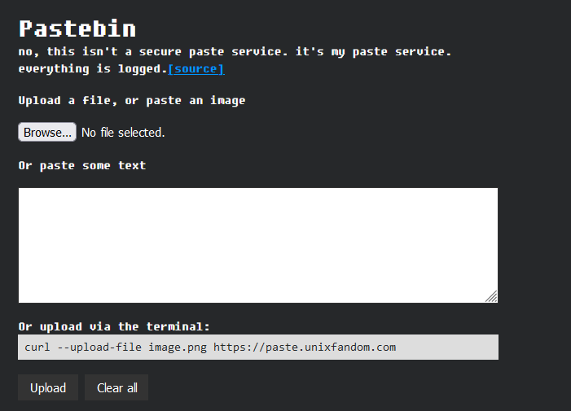

# tempbin

Self-hosted temporary text paste, file and image host.

## Fork Changes
- Environmental variable added to specify your domain name when returning the paste URL
- Random ID generated for URLS increased from 4 to 15
- Removed the file expiration time
- Custom frontpage (made for myself to use)



## Features

- Upload images by pasting on the page
- JavaScript not required
- Upload from terminal: `curl --upload-file image.png http://localhost:1337`

## Set up

```bash
# Clone the repository
git clone https://github.com/peterunix/tempbin

# Run it
cd tempbin
LISTEN='127.0.0.1:1337' DOMAIN=paste.unixfandom.com cargo run
```

## Configuration

Right now, most of the configuration is baked into the binary. Edit the source
code and recompile it to update.

A convenience script `build.sh` is provided to help generate statically linked
release builds.
